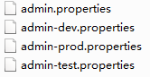

# SpringCloud系列

## SpringCloud使用Config作为配置中心

### 一、介绍

​	服务端：配置中心

​	客户端：接受配置的应用

### 二、配置

#### 1、Server端配置

##### A、pom

     ```pom
  <properties>
    <project.build.sourceEncoding>UTF-8</project.build.sourceEncoding>
    <java.version>1.8</java.version>
  </properties>
  
  <parent>
    <groupId>org.springframework.boot</groupId>
    <artifactId>spring-boot-parent</artifactId>
    <version>1.5.13.RELEASE</version>
  </parent>

  <dependencies>
    <dependency>
      <groupId>org.springframework.cloud</groupId>
      <artifactId>spring-cloud-config-server</artifactId>
    </dependency>
  </dependencies>
 
  <!-- 添加spring-boot的maven插件 -->
  <build>
    <plugins>
      <plugin>
        <groupId>org.springframework.boot</groupId>
        <artifactId>spring-boot-maven-plugin</artifactId>
      </plugin>
    </plugins>
  </build>
     ```

##### B、yml

```yml
server:
    port: 9000
spring:
    application:
        name: lemon-config-server
    cloud:
        config:
            server:
                git:
                	# SpringCloud Config 的配置是放在git上的
                    uri: https://github.com/ATSJP/lemon-config
                    # 指定搜索根路径下的所有目录，若有多个路径使用逗号隔开
                    search-paths: /**  
```

##### C、Application

```
import org.springframework.boot.SpringApplication;
import org.springframework.boot.autoconfigure.SpringBootApplication;
import org.springframework.cloud.config.server.EnableConfigServer;

/**
 * @author sjp
 */
@EnableConfigServer
@SpringBootApplication
public class LemonConfigApplication {

	public static void main(String[] args) {
		SpringApplication.run(LemonConfigApplication.class, args);
	}

}

```

全部配置好后，启动应用，访问 http://localhost:9000/admin/dev （http://localhost:9000/admin-dev.json，http://localhost:9000/admin-dev.properties）



#### 2、Client端配置

##### A、pom

```pom
  <properties>
    <project.build.sourceEncoding>UTF-8</project.build.sourceEncoding>
    <java.version>1.8</java.version>
  </properties>

  <parent>
    <groupId>org.springframework.boot</groupId>
    <artifactId>spring-boot-parent</artifactId>
    <version>1.5.13.RELEASE</version>
  </parent>

  <dependencies>
    <dependency>
      <groupId>org.springframework.boot</groupId>
      <artifactId>spring-boot-starter-web</artifactId>
    </dependency>
    <!-- 实现Config的客户端配置 -->
    <dependency>
      <groupId>org.springframework.cloud</groupId>
      <artifactId>spring-cloud-starter-config</artifactId>
    </dependency>
    <!-- 实现通过端点refresh手动刷新 -->
    <dependency>
      <groupId>org.springframework.boot</groupId>
      <artifactId>spring-boot-starter-actuator</artifactId>
    </dependency>
  </dependencies>
  
  <!-- 添加spring-boot的maven插件 -->
  <build>
    <plugins>
      <plugin>
        <groupId>org.springframework.boot</groupId>
        <artifactId>spring-boot-maven-plugin</artifactId>
      </plugin>
    </plugins>
  </build>
```

##### B、yml

1) bootstrap.yml

```yml
# 对应着config server所获取配置文件的{application}和URL
spring:
    application:
        name: admin
    cloud:
        config:
            uri: http://localhost:9000/
            # 对应着文件后面的后缀{profile}
            profile: dev
            # 分支
            label: master
```

2) application.yml

```yml
version-config: ${version}
```

##### C、Application

```java
@SpringBootApplication
public class LemonAdminApplication {

	public static void main(String[] args) {
		SpringApplication.run(LemonAdminApplication.class, args);
	}

}
```

##### D、Controller

```java
import org.springframework.beans.factory.annotation.Value;
import org.springframework.stereotype.Controller;
import org.springframework.web.bind.annotation.GetMapping;
import org.springframework.web.bind.annotation.RestController;

@Controller
@RestController
public class LoginController {

    @Value("${version-config}")
    private String version;

    @GetMapping("/test")
    public String getVersion() {
        return this.version;
    }
    
}
```

### 三、踩坑

