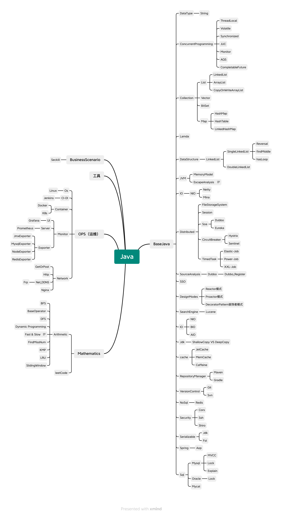

# About

Daily notes and knowledge accumulation...

## KnowledgeTree



## Source
**Where can I  read?**

- [Github Page](https://atsjp.github.io/JavaLearnMap/) >> [Content ](https://atsjp.github.io/JavaLearnMap/SUMMARY.html)
- [Gitbook](https://atsjp.gitbook.io/)
- [语雀](https://www.yuque.com/atsjp/note)


**Where is project？**

- [Github](https://github.com/atsjp/JavaLearnMap)
  Always Lastest...

  [](https://github.com/atsjp/JavaLearnMap)

- [Gitee](https://gitee.com/atsjp/JavaLearnMap)
  Sync From Github...

  [](https://gitee.com/atsjp/JavaLearnMap)

# Mythical Creatures


# For controller

## How to Publish

### Github Page

#### Catalogue Index

Copy `README.md` to `index.md`

#### Content

Github Page auto generate content from current project's markdown file.

### Gitbook

#### Catalogue

**Manual sync catalogue**：

First, use [Gitbook-Summary](https://github.com/imfly/gitbook-summary) to generate `Summary.md`, like this:

```shell
book sm
```
Second, push to Github.

#### Content

Gitbook Auto sync content.

### 语雀

Manual sync all data
