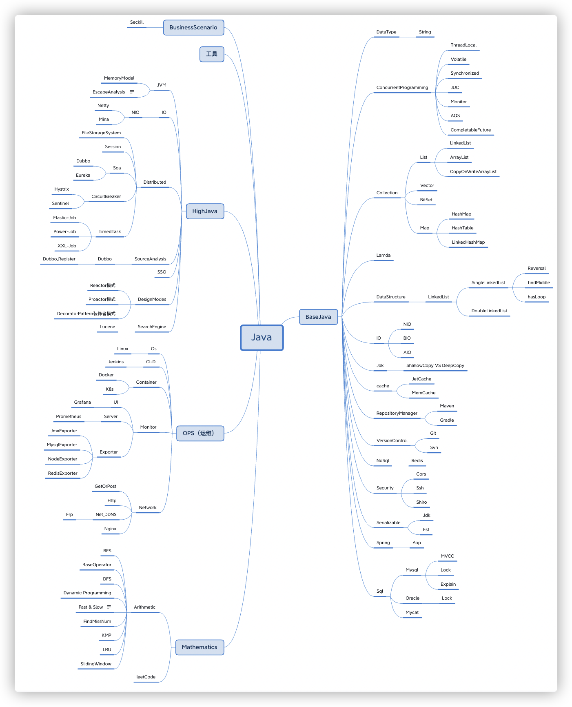
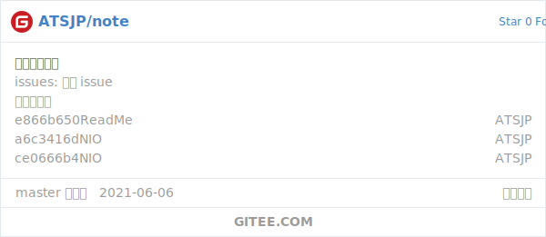

# About

Daily notes and knowledge accumulation...

## KnowledgeTree



## Source

**Where can i read?**

- [Github Page](https://atsjp.github.io/note/) >> [Content ](https://atsjp.github.io/note/SUMMARY.html)

- [Gitbook](https://atsjp.gitbook.io/)

- [Github](https://github.com/atsjp/note)

  [](https://github.com/atsjp/note)  

- [Gitee](https://gitee.com/atsjp/note) 

  []()

# Mythical Creatures


# For controller

## How to Publish

### Github Page

First, config `_config.yml`.

Second, update `index.md`

```shell
book sm -o index.md
```

Second, push code to Github.

### Gitbook

First, use [Gitbook-Summary](https://github.com/imfly/gitbook-summary) to generate `Summary.md`, like this:

```shell
book sm
```

Second, create Gitbook At [Gitbook.com](https://www.gitbook.com/), choose auto synchronize from Github.

Third, push code to Github.


