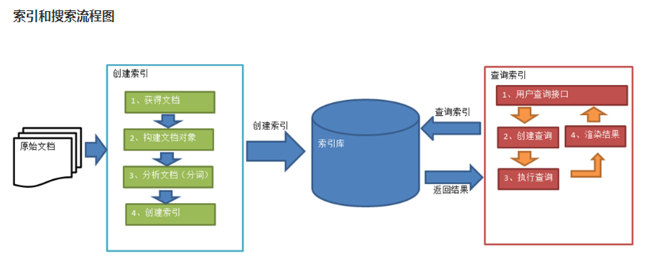

# lucene入门

## Lucene简介

　　Lucene是apache软件基金会4 jakarta项目组的一个子项目，是一个开放源代码的全文检索引擎工具包，但它不是一个完整的全文检索引擎，而是一个全文检索引擎的架构，提供了完整的查询引擎和索引引擎，部分文本分析引擎（英文与德文两种西方语言）。Lucene的目的是为软件开发人员提供一个简单易用的工具包，以方便的在目标系统中实现全文检索的功能，或者是以此为基础建立起完整的全文检索引擎。Lucene是一套用于全文检索和搜寻的开源程式库，由Apache软件基金会支持和提供。Lucene提供了一个简单却强大的应用程式接口，能够做全文索引和搜寻。在Java开发环境里Lucene是一个成熟的免费开源工具。就其本身而言，Lucene是当前以及最近几年最受欢迎的免费Java信息检索程序库。人们经常提到信息检索程序库，虽然与搜索引擎有关，但不应该将信息检索程序库与搜索引擎相混淆。

### 那么先来说一说什么是全文搜索

　　说之前先说一说**数据的分类**：　

　　　　我们生活中的数据总体分为两种：结构化数据和非结构化数据。

　　　　（1）**结构化数据**：指具有固定格式或有限长度的数据，如数据库，元数据等。

　　　　（2）**非结构化数据**：指不定长或无固定格式的数据，如邮件，word文档等磁盘上的文件

## 结构化数据查询方法

### 数据库搜索

　　数据库中的搜索很容易实现，通常都是使用sql语句进行查询，而且能很快的得到查询结果。

　　为什么数据库搜索很容易？

　　因为数据库中的数据存储是有规律的，有行有列而且数据格式、数据长度都是固定的。

### 非结构化数据查询方法

　　**（1）** **顺序扫描法** **(Serial Scanning)**

　　所谓顺序扫描，比如要找内容包含某一个字符串的文件，就是一个文档一个文档的看，对于每一个文档，从头看到尾，如果此文档包含此字符串，则此文档为我们要找的文件，接着看下一个文件，直到扫描完所有的文件。如利用windows的搜索也可以搜索文件内容，只是**相当的慢**。

　　**（2）** **全文检索** **(Full-text Search)**

　　将非结构化数据中的一部分信息提取出来，重新组织，使其变得有一定结构，然后对此有一定结构的数据进行搜索，从而达到搜索相对较快的目的。这部分从非结构化数据中提取出的然后重新组织的信息，我们称之**索引**。

例如：字典。字典的拼音表和部首检字表就相当于字典的索引，对每一个字的解释是非结构化的，如果字典没有音节表和部首检字表，在茫茫辞海中找一个字只能顺序扫描。然而字的某些信息可以提取出来进行结构化处理，比如读音，就比较结构化，分声母和韵母，分别只有几种可以一一列举，于是将读音拿出来按一定的顺序排列，每一项读音都指向此字的详细解释的页数。我们搜索时按结构化的拼音搜到读音，然后按其指向的页数，便可找到我们的非结构化数据——也即对字的解释。

　　**这种先建立索引，再对索引进行搜索的过程就叫全文检索****(Full-text Search)****。**

　　虽然创建索引的过程也是非常耗时的，但是索引一旦创建就可以多次使用，全文检索主要处理的是查询，所以耗时间创建索引是值得的。

### 全文检索的应用场景

　　对于数据量大、数据结构不固定的数据可采用全文检索方式搜索，比如百度、Google等搜索引擎、论坛站内搜索、电商网站站内搜索等。

## 　　Lucene实现全文检索的流程

### 　　索引和搜索流程图


　　1、绿色表示索引过程，对要搜索的原始内容进行索引构建一个索引库，索引过程包括：

　　　　确定原始内容即要搜索的内容→采集文档→创建文档→分析文档→索引文档

　　2、红色表示搜索过程，从索引库中搜索内容，搜索过程包括：

　　　　用户通过搜索界面→创建查询→执行搜索，从索引库搜索→渲染搜索结果

 

　　接下来详细讲解一下这张图片：　

## 　1，创建索引

　　对文档索引的过程，将用户要搜索的文档内容进行索引，索引存储在索引库（index）中。

这里我们要搜索的文档是磁盘上的文本文件，根据案例描述：凡是文件名或文件内容包括关键字的文件都要找出来，这里要对文件名和文件内容创建索引。

### 　　1.1.1.   获得原始文档

　　**原始文档**是指要索引和搜索的内容。原始内容包括互联网上的网页、数据库中的数据、磁盘上的文件等。

　　从互联网上、数据库、文件系统中等获取需要搜索的原始信息，这个过程就是信息采集，信息采集的目的是为了对原始内容进行索引。在Internet上采集信息的软件通常称为爬虫或蜘蛛，也称为网络机器人，爬虫访问互联网上的每一个网页，将获取到的网页内容存储起来。

​        Lucene不提供信息采集的类库，需要自己编写一个爬虫程序实现信息采集，也可以通过一些开源软件实现信息采集，如下：

​         （1）Nutch（<http://lucene.apache.org/nutch>）, Nutch是apache的一个子项目，包括大规模爬虫工具，能够抓取和分辨web网站数据。

​         （2）jsoup（http://jsoup.org/ ），jsoup 是一款Java 的HTML解析器，可直接解析某个URL地址、HTML文本内容。它提供了一套非常省力的API，可通过DOM，CSS以及类似于jQuery的操作方法来取出和操作数据。

​         （3）heritrix（http://sourceforge.net/projects/archive-crawler/files/），Heritrix 是一个由 java 开发的、开源的网络爬虫，用户可以使用它来从网上抓取想要的资源。其最出色之处在于它良好的可扩展性，方便用户实现自己的抓取逻辑。

 

　　本案例我们要获取磁盘上文件的内容，可以通过文件流来读取文本文件的内容，对于pdf、doc、xls等文件可通过第三方提供的解析工具读取文件内容，比如Apache POI读取doc和xls的文件内容。 

 

### 　　1.1.2.   创建文档对象

　　获取原始内容的目的是为了索引，在索引前需要将原始内容创建成文档（Document），文档中包括一个一个的域（Field），域中存储内容。

这里我们可以将磁盘上的一个文件当成一个document，Document中包括一些Field（file_name文件名称、file_path文件路径、file_size文件大小、file_content文件内容），如下图：


 

　　注意：（1）每个Document可以有多个Field

　　　　　（2）不同的Document可以有不同的Field

　　　　　（3）同一个Document可以有相同的Field（域名和域值都相同）

　　　　　（4）每个文档都有一个唯一的编号，就是文档id。

 

### 　　1.1.3.   分析文档

　　将原始内容创建为包含域（Field）的文档（document），需要再对域中的内容进行分析，分析的过程是经过对原始文档提取单词、将字母转为小写、去除标点符号、去除停用词等过程生成最终的语汇单元，可以将语汇单元理解为一个一个的单词。

　　比如下边的文档经过分析如下：

　　原文档内容：

　　Lucene is a Java full-text search engine.  

　　分析后得到的**语汇单元**：

　　lucene、java、full、search、engine

 

　　每个单词叫做一个**Term**，不同的域中拆分出来的相同的单词是不同的term。term中包含两部分一部分是文档的域名，另一部分是单词的内容。

　　例如：文件名中包含apache和文件内容中包含的apache是不同的term。

 

### 　　1.1.4.   创建索引

　　对所有文档分析得出的语汇单元进行索引，索引的目的是为了搜索，最终要实现只搜索被索引的语汇单元从而找到Document（文档）。


 

###  ****

 

　　注意：（1）创建索引是对语汇单元索引，通过词语找文档，这种索引的结构叫**倒排索引结构**。

　　　　　（2）传统方法是根据文件找到该文件的内容，在文件内容中匹配搜索关键字，这种方法是顺序扫描方法，数据量大、搜索慢。

　　           **（3）倒排索引结构**是根据内容（词语）找文档，如下图：


 

　　**倒排索引结构也叫反向索引结构，包括索引和文档两部分，索引即词汇表，它的规模较小，而文档集合较大。**

　　

　　**创建索引代码实例：**

　　新建一个Java工程，导入相关的jar包


 

　　编写创建索引代码

　　使用indexwriter对象创建索引

　　**具体步骤：**

　　第一步：创建一个indexwriter对象。

　　　　1）指定索引库的存放位置Directory对象

　　　　2）指定一个分析器，对文档内容进行分析。

　　第二步：创建document对象。

　　第三步：创建field对象，将field添加到document对象中。

　　第四步：使用indexwriter对象将document对象写入索引库，此过程进行索引创建。并将索引和document对象写入索引库。

　　第五步：关闭IndexWriter对象。

[](javascript:void(0);)

```
 1     //创建索引
 2     public void testCreateIndex() throws IOException{
 3         //指定索引库的存放位置Directory对象
 4         Directory directory = FSDirectory.open(new File("E:\\programme\\test"));
 5         //索引库还可以存放到内存中
 6         //Directory directory = new RAMDirectory();
 7 
 8         //指定一个标准分析器，对文档内容进行分析
 9         Analyzer analyzer = new StandardAnalyzer();
10         
11         //创建indexwriterCofig对象
12         //第一个参数： Lucene的版本信息，可以选择对应的lucene版本也可以使用LATEST
13         //第二根参数：分析器对象
14         IndexWriterConfig config = new IndexWriterConfig(Version.LATEST, analyzer);
15         
16         //创建一个indexwriter对象
17         IndexWriter indexWriter = new IndexWriter(directory, config);
18         
19         //原始文档的路径
20         File file = new File("E:\\programme\\searchsource");
21         File[] fileList = file.listFiles();
22         for (File file2 : fileList) {
23             //创建document对象
24             Document document = new Document();
25             
26             //创建field对象，将field添加到document对象中
27             
28             //文件名称
29             String fileName = file2.getName();
30             //创建文件名域
31             //第一个参数：域的名称
32             //第二个参数：域的内容
33             //第三个参数：是否存储
34             Field fileNameField = new TextField("fileName", fileName, Store.YES);
35             
36             //文件的大小
37             long fileSize  = FileUtils.sizeOf(file2);
38             //文件大小域
39             Field fileSizeField = new LongField("fileSize", fileSize, Store.YES);
40             
41             //文件路径
42             String filePath = file2.getPath();
43             //文件路径域（不分析、不索引、只存储）
44             Field filePathField = new StoredField("filePath", filePath);
45             
46             //文件内容
47             String fileContent = FileUtils.readFileToString(file2);
48             //String fileContent = FileUtils.readFileToString(file2, "utf-8");
49             //文件内容域
50             Field fileContentField = new TextField("fileContent", fileContent, Store.YES);
51             
52             document.add(fileNameField);
53             document.add(fileSizeField);
54             document.add(filePathField);
55             document.add(fileContentField);
56             //使用indexwriter对象将document对象写入索引库，此过程进行索引创建。并将索引和document对象写入索引库。
57             indexWriter.addDocument(document);
58         }
59         //关闭IndexWriter对象。
60         indexWriter.close();
61     }
```

[](javascript:void(0);)

 

## 　　 Field域的属性概述

　　**是否分析**：是否对域的内容进行分词处理。前提是我们要对域的内容进行查询。

　　**是否索引**：将Field分析后的词或整个Field值进行索引，只有索引方可搜索到。

　　比如：商品名称、商品简介分析后进行索引，订单号、身份证号不用分析但也要索引，这些将来都要作为查询条件。

　　**是否存储**：将Field值存储在文档中，存储在文档中的Field才可以从Document中获取

　　比如：商品名称、订单号，凡是将来要从Document中获取的Field都要存储。

 

　　**是否存储的标准：是否要将内容展示给用户**

| Field类                                                      | 数据类型               | Analyzed是否分析 | Indexed是否索引 | Stored是否存储 | 说明                                                         |
| ------------------------------------------------------------ | ---------------------- | ---------------- | --------------- | -------------- | ------------------------------------------------------------ |
| StringField(FieldName, FieldValue,Store.YES))                | 字符串                 | N                | Y               | Y或N           | 这个Field用来构建一个字符串Field，但是不会进行分析，会将整个串存储在索引中，比如(订单号,姓名等)是否存储在文档中用Store.YES或Store.NO决定 |
| LongField(FieldName, FieldValue,Store.YES)                   | Long型                 | Y                | Y               | Y或N           | 这个Field用来构建一个Long数字型Field，进行分析和索引，比如(价格)是否存储在文档中用Store.YES或Store.NO决定 |
| StoredField(FieldName, FieldValue)                           | 重载方法，支持多种类型 | N                | N               | Y              | 这个Field用来构建不同类型Field不分析，不索引，但要Field存储在文档中 |
| TextField(FieldName, FieldValue, Store.NO)或TextField(FieldName, reader) | 字符串或流             | Y                | Y               | Y或N           | 如果是一个Reader, lucene猜测内容比较多,会采用Unstored的策略. |

 

## 　　2. 查询索引

　　查询索引也是搜索的过程。搜索就是用户输入关键字，从索引（index）中进行搜索的过程。根据关键字搜索索引，根据索引找到对应的文档，从而找到要搜索的内容（这里指磁盘上的文件）。

​       对要搜索的信息创建Query查询对象，Lucene会根据Query查询对象生成最终的查询语法，类似关系数据库Sql语法一样Lucene也有自己的查询语法，比如：“name:lucene”表示查询Field的name为“lucene”的文档信息。

### 　　2.1.   用户查询接口

　　全文检索系统提供用户搜索的界面供用户提交搜索的关键字，搜索完成展示搜索结果。

　　比如： 百度搜索

　　Lucene不提供制作用户搜索界面的功能，需要根据自己的需求开发搜索界面。

### 　　2.2.   创建查询

　　用户输入查询关键字执行搜索之前需要先构建一个查询对象，查询对象中可以指定查询要搜索的Field文档域、查询关键字等，查询对象会生成具体的查询语法，

　　例如： 语法 “fileName:lucene”表示要搜索Field域的内容为“lucene”的文档

### 　　2.3.   执行查询

　　搜索索引过程：

　　根据查询语法在倒排索引词典表中分别找出对应搜索词的索引，从而找到索引所链接的文档链表。

　　比如搜索语法为“fileName:lucene”表示搜索出fileName域中包含Lucene的文档。

　　搜索过程就是在索引上查找域为fileName，并且关键字为Lucene的term，并根据term找到文档id列表。

 

​       可通过两种方法创建查询对象：

​         1）使用Lucene提供Query子类

​         Query是一个抽象类，lucene提供了很多查询对象，比如TermQuery项精确查询，NumericRangeQuery数字范围查询等。

​         如下代码：

​    　　Query query = **new** TermQuery(**new** Term("name", "lucene"));

 

​         2）使用QueryParse解析查询表达式

​         QueryParse会将用户输入的查询表达式解析成Query对象实例。

​         如下代码：

​           QueryParser queryParser = **new** QueryParser("name", **new** IKAnalyzer());

​           Query query = queryParser.parse("name:lucene");

 　　

　　首先，演示第一种方法，**使用query的子类查询**

　　**实现步骤**

　　第一步：创建一个Directory对象，也就是索引库存放的位置。

　　第二步：创建一个indexReader对象，需要指定Directory对象。

　　第三步：创建一个indexsearcher对象，需要指定IndexReader对象

　　第四步：创建一个Query的子类对象，指定查询的域和查询的关键词。

　　第五步：执行查询。

　　第六步：返回查询结果。遍历查询结果并输出。

　　第七步：关闭IndexReader对象

 

### 　　MatchAllDocsQuery

　　使用MatchAllDocsQuery查询索引目录中的所有文档

　　**具体代码：**

[](javascript:void(0);)

```
    @Test
    public void testMatchAllDocsQuery() throws Exception {
        //创建一个Directory对象，指定索引库存放的路径
        Directory directory = FSDirectory.open(new File("E:\\programme\\test"));
        //创建IndexReader对象，需要指定Directory对象
        IndexReader indexReader = DirectoryReader.open(directory);
        //创建Indexsearcher对象，需要指定IndexReader对象
        IndexSearcher indexSearcher = new IndexSearcher(indexReader);
        
        //创建查询条件
        //使用MatchAllDocsQuery查询索引目录中的所有文档
        Query query = new MatchAllDocsQuery();
        //执行查询
        //第一个参数是查询对象，第二个参数是查询结果返回的最大值
        TopDocs topDocs = indexSearcher.search(query, 10);
        
        //查询结果的总条数
        System.out.println("查询结果的总条数："+ topDocs.totalHits);
        //遍历查询结果
        //topDocs.scoreDocs存储了document对象的id
        //ScoreDoc[] scoreDocs = topDocs.scoreDocs;
        for (ScoreDoc scoreDoc : topDocs.scoreDocs) {
            //scoreDoc.doc属性就是document对象的id
            //int doc = scoreDoc.doc;
            //根据document的id找到document对象
            Document document = indexSearcher.doc(scoreDoc.doc);
            //文件名称
            System.out.println(document.get("fileName"));
            //文件内容
            System.out.println(document.get("fileContent"));
            //文件大小
            System.out.println(document.get("fileSize"));
            //文件路径
            System.out.println(document.get("filePath"));
            System.out.println("----------------------------------");
        }
        //关闭indexreader对象
        indexReader.close();
    }
```

[](javascript:void(0);)

 

 

### 　　TermQuery（精准查询）

　　TermQuery，通过项查询，TermQuery不使用分析器所以建议匹配不分词的Field域查询，比如订单号、分类ID号等。

指定要查询的域和要查询的关键词。

　　**具体代码：** 

[](javascript:void(0);)

```
 1     //搜索索引
 2     @Test
 3     public void testSearchIndex() throws IOException{
 4         //创建一个Directory对象，指定索引库存放的路径
 5         Directory directory = FSDirectory.open(new File("E:\\programme\\test"));
 6         //创建IndexReader对象，需要指定Directory对象
 7         IndexReader indexReader = DirectoryReader.open(directory);
 8         //创建Indexsearcher对象，需要指定IndexReader对象
 9         IndexSearcher indexSearcher = new IndexSearcher(indexReader);
10         //创建一个TermQuery（精准查询）对象，指定查询的域与查询的关键词
11         //创建查询
12         Query query = new TermQuery(new Term("fileName", "apache"));
13         //执行查询
14         //第一个参数是查询对象，第二个参数是查询结果返回的最大值
15         TopDocs topDocs = indexSearcher.search(query, 10);
16         //查询结果的总条数
17         System.out.println("查询结果的总条数："+ topDocs.totalHits);
18         //遍历查询结果
19         //topDocs.scoreDocs存储了document对象的id
20         //ScoreDoc[] scoreDocs = topDocs.scoreDocs;
21         for (ScoreDoc scoreDoc : topDocs.scoreDocs) {
22             //scoreDoc.doc属性就是document对象的id
23             //int doc = scoreDoc.doc;
24             //根据document的id找到document对象
25             Document document = indexSearcher.doc(scoreDoc.doc);
26             //文件名称
27             System.out.println(document.get("fileName"));
28             //文件内容
29             System.out.println(document.get("fileContent"));
30             //文件大小
31             System.out.println(document.get("fileSize"));
32             //文件路径
33             System.out.println(document.get("filePath"));
34             System.out.println("----------------------------------");
35         }
36         //关闭indexreader对象
37         indexReader.close();
38     }
39 }
```

[](javascript:void(0);)

 

### 　　NumericRangeQuery

　　可以根据数值范围查询。

　　**具体代码：**

[](javascript:void(0);)

```
    //数值范围查询
    @Test
    public void testNumericRangeQuery() throws Exception {
        //创建一个Directory对象，指定索引库存放的路径
        Directory directory = FSDirectory.open(new File("E:\\programme\\test"));
        //创建IndexReader对象，需要指定Directory对象
        IndexReader indexReader = DirectoryReader.open(directory);
        //创建Indexsearcher对象，需要指定IndexReader对象
        IndexSearcher indexSearcher = new IndexSearcher(indexReader);
        
        //创建查询
        //参数：
        //1.域名
        //2.最小值
        //3.最大值
        //4.是否包含最小值
        //5.是否包含最大值
        Query query = NumericRangeQuery.newLongRange("fileSize", 41L, 2055L, true, true);
        //执行查询

        //第一个参数是查询对象，第二个参数是查询结果返回的最大值
        TopDocs topDocs = indexSearcher.search(query, 10);
        
        //查询结果的总条数
        System.out.println("查询结果的总条数："+ topDocs.totalHits);
        //遍历查询结果
        //topDocs.scoreDocs存储了document对象的id
        //ScoreDoc[] scoreDocs = topDocs.scoreDocs;
        for (ScoreDoc scoreDoc : topDocs.scoreDocs) {
            //scoreDoc.doc属性就是document对象的id
            //int doc = scoreDoc.doc;
            //根据document的id找到document对象
            Document document = indexSearcher.doc(scoreDoc.doc);
            //文件名称
            System.out.println(document.get("fileName"));
            //文件内容
            System.out.println(document.get("fileContent"));
            //文件大小
            System.out.println(document.get("fileSize"));
            //文件路径
            System.out.println(document.get("filePath"));
            System.out.println("----------------------------------");
        }
        //关闭indexreader对象
        indexReader.close();
    }
```

[](javascript:void(0);)

 

 

### 　　BooleanQuery

　　可以组合查询条件。

　　**具体代码：**

[](javascript:void(0);)

```
    //组合条件查询
    @Test
    public void testBooleanQuery() throws Exception {
        //创建一个Directory对象，指定索引库存放的路径
        Directory directory = FSDirectory.open(new File("E:\\programme\\test"));
        //创建IndexReader对象，需要指定Directory对象
        IndexReader indexReader = DirectoryReader.open(directory);
        //创建Indexsearcher对象，需要指定IndexReader对象
        IndexSearcher indexSearcher = new IndexSearcher(indexReader);
        
        //创建一个布尔查询对象
        BooleanQuery query = new BooleanQuery();
        //创建第一个查询条件
        Query query1 = new TermQuery(new Term("fileName", "apache"));
        Query query2 = new TermQuery(new Term("fileName", "lucene"));
        //组合查询条件
        query.add(query1, Occur.MUST);
        query.add(query2, Occur.MUST);
        //执行查询

        //第一个参数是查询对象，第二个参数是查询结果返回的最大值
        TopDocs topDocs = indexSearcher.search(query, 10);
        
        //查询结果的总条数
        System.out.println("查询结果的总条数："+ topDocs.totalHits);
        //遍历查询结果
        //topDocs.scoreDocs存储了document对象的id
        //ScoreDoc[] scoreDocs = topDocs.scoreDocs;
        for (ScoreDoc scoreDoc : topDocs.scoreDocs) {
            //scoreDoc.doc属性就是document对象的id
            //int doc = scoreDoc.doc;
            //根据document的id找到document对象
            Document document = indexSearcher.doc(scoreDoc.doc);
            //文件名称
            System.out.println(document.get("fileName"));
            //文件内容
            System.out.println(document.get("fileContent"));
            //文件大小
            System.out.println(document.get("fileSize"));
            //文件路径
            System.out.println(document.get("filePath"));
            System.out.println("----------------------------------");
        }
        //关闭indexreader对象
        indexReader.close();
    }
```

[](javascript:void(0);)

　　Occur.MUST：必须满足此条件，相当于and

　　Occur.SHOULD：应该满足，但是不满足也可以，相当于or

　　Occur.MUST_NOT：必须不满足。相当于not

 

　　接着，演示第二种方法：**使用queryparser查询**

　　通过QueryParser也可以创建Query，QueryParser提供一个Parse方法，此方法可以直接根据查询语法来查询。Query对象执行的查询语法可通过System.out.println(query);查询。

　　这个操作需要使用到分析器。建议创建索引时使用的分析器和查询索引时使用的分析器要一致。

　　**queryparser**

　　**具体代码：**

[](javascript:void(0);)

```
    @Test
    public void testQueryParser() throws Exception {
        //创建一个Directory对象，指定索引库存放的路径
        Directory directory = FSDirectory.open(new File("E:\\programme\\test"));
        //创建IndexReader对象，需要指定Directory对象
        IndexReader indexReader = DirectoryReader.open(directory);
        //创建Indexsearcher对象，需要指定IndexReader对象
        IndexSearcher indexSearcher = new IndexSearcher(indexReader);
        
        //创建queryparser对象
        //第一个参数默认搜索的域
        //第二个参数就是分析器对象
        QueryParser queryParser = new QueryParser("fileName", new IKAnalyzer());
        //使用默认的域,这里用的是语法，下面会详细讲解一下
        Query query = queryParser.parse("apache");
        //不使用默认的域，可以自己指定域
        //Query query = queryParser.parse("fileContent:apache");
        //执行查询


        //第一个参数是查询对象，第二个参数是查询结果返回的最大值
        TopDocs topDocs = indexSearcher.search(query, 10);
        
        //查询结果的总条数
        System.out.println("查询结果的总条数："+ topDocs.totalHits);
        //遍历查询结果
        //topDocs.scoreDocs存储了document对象的id
        //ScoreDoc[] scoreDocs = topDocs.scoreDocs;
        for (ScoreDoc scoreDoc : topDocs.scoreDocs) {
            //scoreDoc.doc属性就是document对象的id
            //int doc = scoreDoc.doc;
            //根据document的id找到document对象
            Document document = indexSearcher.doc(scoreDoc.doc);
            //文件名称
            System.out.println(document.get("fileName"));
            //文件内容
            System.out.println(document.get("fileContent"));
            //文件大小
            System.out.println(document.get("fileSize"));
            //文件路径
            System.out.println(document.get("filePath"));
            System.out.println("----------------------------------");
        }
        //关闭indexreader对象
        indexReader.close();        
    }
```

[](javascript:void(0);)

 

#### 　　查询语法

　　1、基础的查询语法，关键词查询：

　　　　域名+“：”+搜索的关键字

　　　　例如：content:java

　　2、范围查询

　　　　域名+“:”+[最小值 TO 最大值]

　　　　例如：size:[1 TO 1000]

　　　　范围查询在lucene中支持数值类型，不支持字符串类型。在solr中支持字符串类型。

　　3、组合条件查询

　　　　1）+条件1 +条件2：两个条件之间是并且的关系and

　　　　　　例如：+filename:apache +content:apache

　　　　2）+条件1 条件2：必须满足第一个条件，应该满足第二个条件

　　　　　　例如：+filename:apache content:apache

　　　　3）条件1 条件2：两个条件满足其一即可。

　　　　　　例如：filename:apache content:apache

　　　　4）-条件1 条件2：必须不满足条件1，要满足条件2

　　　　　　例如：-filename:apache content:apache

| Occur.MUST 查询条件必须满足，相当于and       | +（加号）      |
| -------------------------------------------- | -------------- |
| Occur.SHOULD 查询条件可选，相当于or          | 空（不用符号） |
| Occur.MUST_NOT 查询条件不能满足，相当于not非 | -（减号）      |

 

　　第二种写法：

　　条件1 AND 条件2

　　条件1 OR 条件2

　　条件1 NOT 条件2

 

### 　　MultiFieldQueryParser

　　可以指定多个默认搜索域

　　**具体代码：**

[](javascript:void(0);)

```
 1     @Test
 2     public void testMultiFiledQueryParser() throws Exception {
 3         //创建一个Directory对象，指定索引库存放的路径
 4         Directory directory = FSDirectory.open(new File("E:\\programme\\test"));
 5         //创建IndexReader对象，需要指定Directory对象
 6         IndexReader indexReader = DirectoryReader.open(directory);
 7         //创建Indexsearcher对象，需要指定IndexReader对象
 8         IndexSearcher indexSearcher = new IndexSearcher(indexReader);
 9         
10         //可以指定默认搜索的域是多个
11         String[] fields = {"fileName", "fileContent"};
12         //创建一个MulitFiledQueryParser对象
13         MultiFieldQueryParser queryParser = new MultiFieldQueryParser(fields, new IKAnalyzer());
14         Query query = queryParser.parse("apache");
15         System.out.println(query);
16         //执行查询
17 
18 
19         //第一个参数是查询对象，第二个参数是查询结果返回的最大值
20         TopDocs topDocs = indexSearcher.search(query, 10);
21         
22         //查询结果的总条数
23         System.out.println("查询结果的总条数："+ topDocs.totalHits);
24         //遍历查询结果
25         //topDocs.scoreDocs存储了document对象的id
26         //ScoreDoc[] scoreDocs = topDocs.scoreDocs;
27         for (ScoreDoc scoreDoc : topDocs.scoreDocs) {
28             //scoreDoc.doc属性就是document对象的id
29             //int doc = scoreDoc.doc;
30             //根据document的id找到document对象
31             Document document = indexSearcher.doc(scoreDoc.doc);
32             //文件名称
33             System.out.println(document.get("fileName"));
34             //文件内容
35             System.out.println(document.get("fileContent"));
36             //文件大小
37             System.out.println(document.get("fileSize"));
38             //文件路径
39             System.out.println(document.get("filePath"));
40             System.out.println("----------------------------------");
41         }
42         //关闭indexreader对象
43         indexReader.close();
44     }
```

[](javascript:void(0);)

 

 

##  IndexSearcher搜索方法

| 方法                                                | 说明                                                         |
| --------------------------------------------------- | ------------------------------------------------------------ |
| indexSearcher.search(query, n)                      | 根据Query搜索，返回评分最高的n条记录                         |
| indexSearcher.search(query, filter, n)              | 根据Query搜索，添加过滤策略，返回评分最高的n条记录           |
| indexSearcher.search(query, n, sort)                | 根据Query搜索，添加排序策略，返回评分最高的n条记录           |
| indexSearcher.search(booleanQuery, filter, n, sort) | 根据Query搜索，添加过滤策略，添加排序策略，返回评分最高的n条记录 |

 

 

## 　　TopDocs

　　Lucene搜索结果可通过TopDocs遍历，TopDocs类提供了少量的属性，如下：

| 方法或属性 | 说明                   |
| ---------- | ---------------------- |
| totalHits  | 匹配搜索条件的总记录数 |
| scoreDocs  | 顶部匹配记录           |

 

　　注意：

　　　　（1）Search方法需要指定匹配记录数量n：indexSearcher.search(query, n)

　　　　（2）TopDocs.totalHits：是匹配索引库中所有记录的数量

　　　　（3）TopDocs.scoreDocs：匹配相关度高的前边记录数组，scoreDocs的长度小于等于search方法指定的参数n

　　

　　**中文分词器 ：**

　　首先，看一看Lucene自带的中文分词器

　　（1）StandardAnalyzer：（标准分词器，也是前面例子中使用的分词器）

　　　　单字分词：就是按照中文一个字一个字地进行分词。

　　　　如：“我爱中国”，
　　　　效果：“我”、“爱”、“中”、“国”。

　　（2）CJKAnalyzer

　　　　二分法分词：按两个字进行切分。

　　　　如：“我是中国人”，

　　　　效果：“我是”、“是中”、“中国”“国人”。

　　**但上边两个分词器无法满足需求。**

　　（3）SmartChineseAnalyzer

　　　　对中文支持较好，但扩展性差，扩展词库，禁用词库和同义词库等不好处理

 

　　然后，看一看我们开发真正使用的**第三方中文分词器：**

　　我们今天介绍IK-analyzer这款第三方中文分词器

　　IK-analyzer： 最新版在https://code.google.com/p/ik-analyzer/上，支持Lucene 4.10从2006年12月推出1.0版开始，IKAnalyzer已经推出了4个大版本。最初，它是以开源项目Luence为应用主体的，结合词典分词和文法分析算法的中文分词组件。从3.0版本开 始，IK发展为面向Java的公用分词组件，独立于Lucene项目，同时提供了对Lucene的默认优化实现。在2012版本中，IK实现了简单的分词 歧义排除算法，标志着IK分词器从单纯的词典分词向模拟语义分词衍化。 但是也就是2012年12月后没有在更新。　

　　**使用方法：**

　　第一步：把jar包添加到工程中

　　第二步：把**配置文件**和**扩展词词典**和**停用词词典**添加到classpath下（停用词词典与扩展词词典名称可自行定义，只要在配置文件中配置好就可以了）


 

　　注意：**扩展词词典**和**停用词词典**文件的格式为UTF-8，注意是无BOM 的UTF-8 编码。

　　配置文件详情

[](javascript:void(0);)

```
<?xml version="1.0" encoding="UTF-8"?>
<!DOCTYPE properties SYSTEM "http://java.sun.com/dtd/properties.dtd">  
<properties>  
    <comment>IK Analyzer 扩展配置</comment>
    <!--用户可以在这里配置自己的扩展字典 --> 
    <entry key="ext_dict">ext.dic;</entry> 
    
    <!--用户可以在这里配置自己的扩展停止词字典-->
    <entry key="ext_stopwords">stopword.dic;</entry> 
</properties>
```

[](javascript:void(0);)

 

　　停用词词典与扩展词词典样例：


 

　　这样，创建分析器时，用一下代码就好了

```
Analyzer analyzer = new IKAnalyzer();
```

 

　　**注意：搜索使用的分析器要和索引使用的分析器一致，不然搜索出来结果可能会错乱。**

 

## 　　3. 删除索引

 　　（1）删除全部索引

　　说明：将索引目录的索引信息全部删除，直接彻底删除，无法恢复。**此方法慎用！！**

[](javascript:void(0);)

```
 1     //删除全部索引
 2     @Test
 3     public void testDeleteAllIndex() throws Exception {
 4         Directory directory = FSDirectory.open(new File("E:\\programme\\test"));
 5         Analyzer analyzer = new IKAnalyzer();
 6         IndexWriterConfig config = new IndexWriterConfig(Version.LATEST, analyzer);
 7         IndexWriter indexWriter = new IndexWriter(directory, config);
 8         //删除全部索引
 9         indexWriter.deleteAll();
10         //关闭indexwriter
11         indexWriter.close();
12     }
```

[](javascript:void(0);)

 

　　（2）指定查询条件删除

[](javascript:void(0);)

```
    //根据查询条件删除索引
    @Test
    public void deleteIndexByQuery() throws Exception {
        Directory directory = FSDirectory.open(new File("E:\\programme\\test"));
        Analyzer analyzer = new IKAnalyzer();
        IndexWriterConfig config = new IndexWriterConfig(Version.LATEST, analyzer);
        IndexWriter indexWriter = new IndexWriter(directory, config);
        //创建一个查询条件
        Query query = new TermQuery(new Term("fileContent", "apache"));
        //根据查询条件删除
        indexWriter.deleteDocuments(query);
        //关闭indexwriter
        indexWriter.close();
    }
```

[](javascript:void(0);)

 

## 　　4 索引库的修改

　　更新的原理就是先删除在添加

[](javascript:void(0);)

```
    //修改索引库
    @Test
    public void updateIndex() throws Exception {
        Directory directory = FSDirectory.open(new File("E:\\programme\\test"));
        Analyzer analyzer = new IKAnalyzer();
        IndexWriterConfig config = new IndexWriterConfig(Version.LATEST, analyzer);
        IndexWriter indexWriter = new IndexWriter(directory, config);
        //创建一个Document对象
        Document document = new Document();
        //向document对象中添加域。
        //不同的document可以有不同的域，同一个document可以有相同的域。
        document.add(new TextField("fileXXX", "要更新的文档", Store.YES));
        document.add(new TextField("contentYYY", "简介 Lucene 是一个基于 Java 的全文信息检索工具包。", Store.YES));
        indexWriter.updateDocument(new Term("fileName", "apache"), document);
        //关闭indexWriter
        indexWriter.close();
    }
```

[](javascript:void(0);)

 　　这样，Lucene的简单介绍使用就完成了。

