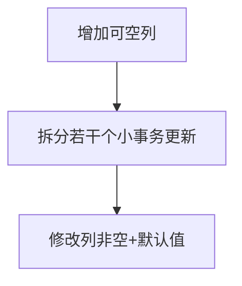

## Oracle之大表DDL操作那些事

***

### 场景一、万级以上数据量在给表增加字段的时候，可以随意执行Alter吗？

下面我们来看这条Alter语句：

1. 给表增加字段并设置默认值

```sql
alter table table_name add (text_type NUMBER(1) default 0 NOT NULL);
```

DDL原理：这条DDL执行，其实是先给表增加一列（不设置默认值及NOT NULL），然后给执行全表的update，更新这个字段为默认值，最终在设置这个字段的默认值及非空。

> 如果各位有大数据量的表，可以使用表备份语句建立备份表，并进行上方这条DDL测试
>```sql
>-- 建表结构+复制数据
>create table newtable as select * from oldtable
>```

很明显，全表的Update肯定会产生行锁也就是3级RX锁，这样数据量越大，处理时间变长，事务也越大。业务在处理DML语句（除Select语句）会因目标行被这里的操作锁住而产生阻塞等待，那么应用程序也就阻塞了，相当于人工手动停机，这样的事肯定没有一个人愿意看见，那么怎么处理合适呢？

首先，分析原因，造成锁表的原因是全表更新，产生的大事务导致，那么我们如果把事务拆解下来，分割一个个的小事务，这样就可以有效的规避全表的行锁了，业务应用层也不会产生阻塞。

既然有了思路，就搞起来。

整体的思路是这样的：



对应Sql，其中`err_log`用来记录错误信息，以供后续分析。

```sql
-- start 
-- 错误日志表-临时
create table ins.err_log_20190826(status varchar2(200));

-- 收藏产品新增字段COLLECT_TYPE
alter table ins.prod_collection add COLLECT_TYPE NUMBER(2);

declare
  n1 number :=0;
  v_str varchar2(200);
begin
  for i in (select COLLECT_ID from ins.prod_collection)
   loop
    n1 := n1+1;
    update ins.prod_collection set COLLECT_TYPE = 0 where COLLECT_ID = i.COLLECT_ID;
    if mod(n1,5000)=0 then 
      commit;    
    end if;
   end loop;
   commit;
exception
  when others then
    rollback;
    v_str := 'prod_collection' || SQLCODE || '_' || SQLERRM;
    insert into err_log_20190826 (status) values(v_str);
    commit;
end;

-- 
-- DECLARE   
--   v_cnt pls_integer;
-- BEGIN 
--   v_cnt:=1;
--   while v_cnt>0 loop
--     update ins.cm_content t set t.top_flag =0, t.text_type =0  where t.top_flag !=0  and rownum<=10000;
--     v_cnt:=sql%rowcount;
--     commit;
--   end loop;
-- END;

-- 修改增加列的默认值
alter table ins.prod_collection modify COLLECT_TYPE default 0 not null;

```

好，到此差不多已经讲完了这个问题，但是平常工作中，我们在没有必要给这个字段加上非空要求时，就可以采用以下的sql，来增加新列，也就不会造成上述说的问题。是因为修改列增加默认值，只会对新插入的数据生效，而历史的数据，是不会处理的。

```sql
alter table table_name add (text_type NUMBER(1));
alter table table_name modify text_type default 0;
```


