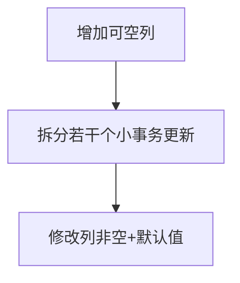
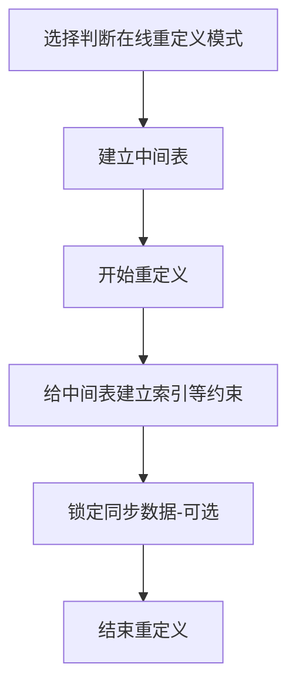

## Oracle之大表DDL操作那些事

***

### 场景一、万级以上数据量在给表增加字段的时候，可以随意执行Alter吗？

下面我们来看这条Alter语句：

1. 给表增加字段并设置默认值

```sql
alter table table_name add (text_type NUMBER(1) default 0 NOT NULL);
```

DDL原理：这条DDL执行，其实是先给表增加一列（不设置默认值及NOT NULL），然后给执行全表的update，更新这个字段为默认值，最终在设置这个字段的默认值及非空。

> 如果各位有大数据量的表，可以使用表备份语句建立备份表，并进行上方这条DDL测试
>```sql
>-- 建表结构+复制数据
>create table newtable as select * from oldtable
>```

很明显，全表的Update肯定会产生行锁也就是3级RX锁，这样数据量越大，处理时间变长，事务也越大。业务在处理DML语句（除Select语句）会因目标行被这里的操作锁住而产生阻塞等待，那么应用程序也就阻塞了，相当于人工手动停机，这样的事肯定没有一个人愿意看见，那么怎么处理合适呢？

#### 方案一

首先，分析原因，造成锁表的原因是全表更新，产生的大事务导致，那么我们如果把事务拆解下来，分割一个个的小事务，这样就可以有效的规避全表的行锁了，业务应用层也不会产生阻塞。

既然有了思路，就搞起来。

整体的思路是这样的：



对应Sql，其中`err_log`用来记录错误信息，以供后续分析。

```sql
-- start 
-- 错误日志表-临时
create table ins.err_log_20190826(status varchar2(200));

-- 收藏产品新增字段COLLECT_TYPE
alter table ins.prod_collection add COLLECT_TYPE NUMBER(2);

declare
  n1 number :=0;
  v_str varchar2(200);
begin
  for i in (select COLLECT_ID from ins.prod_collection)
   loop
    n1 := n1+1;
    update ins.prod_collection set COLLECT_TYPE = 0 where COLLECT_ID = i.COLLECT_ID;
    if mod(n1,5000)=0 then 
      commit;    
    end if;
   end loop;
   commit;
exception
  when others then
    rollback;
    v_str := 'prod_collection' || SQLCODE || '_' || SQLERRM;
    insert into err_log_20190826 (status) values(v_str);
    commit;
end;

-- 
-- DECLARE   
--   v_cnt pls_integer;
-- BEGIN 
--   v_cnt:=1;
--   while v_cnt>0 loop
--     update ins.cm_content t set t.top_flag =0, t.text_type =0  where t.top_flag !=0  and rownum<=10000;
--     v_cnt:=sql%rowcount;
--     commit;
--   end loop;
-- END;

-- 修改增加列的默认值
alter table ins.prod_collection modify COLLECT_TYPE default 0 not null;

```

好，到此差不多已经讲完了这个问题，但是平常工作中，我们在没有必要给这个字段加上非空要求时，就可以采用以下的sql，来增加新列，也就不会造成上述说的问题。是因为修改列增加默认值，只会对新插入的数据生效，而历史的数据，是不会处理的。

```sql
alter table table_name add (text_type NUMBER(1));
alter table table_name modify text_type default 0;
```

#### 方案二

**oracle10G及以上可以使用在线重定义的方式进行。**

官方文档：[点击进入](https://docs.oracle.com/cd/B14117_01/appdev.101/b10802/d_redefi.htm)

Oracle提供了常量供大家使用：

```sql
  dbms_redefinition.cons_use_pk    CONSTANT PLS_INTEGER := 1;
  dbms_redefinition.cons_use_rowid CONSTANT PLS_INTEGER := 2;
```

权限要求

```sql
grant create any table to 用户;
grant alter any table to 用户;
grant drop any table to 用户;
grant lock any table to 用户;
grant select any table to 用户;
grant create any trigger to 用户;
grant create any index to 用户;
```

在线重定义的**思路**：


**原理**：通过对中间表（即想要修改原表的最终结构）执行大量DML复制原表的数据，实现原表的零锁表，以达到不影响用户的操作。最终在结束重定义前，对中间表按照原表建立一套索引等（刚开始建立中间表时，不建议建立索引，会增加重定义的时间，每次DML都需要维护索引），以上都结束后，执行结束重定义，这一步的内部过程会再次同步下数据（即执行锁定同步数据，会锁表，由于数据较少，锁定时间不会太长），数据同步结束后，将表名互换。

**实现步骤**：

> 原表DDL：
>
> ```sql
> CREATE TABLE INS.test_table
> (
>     id NUMBER(10) NOT NULL,
>     link_id NUMBER(10) NOT NULL,
>     link_TYPE NUMBER(2) NOT NULL,
>     CREATE_ID       NUMBER(10),
>     CREATE_TIME     TIMESTAMP(6) DEFAULT sysdate,
>     MODIFY_ID       NUMBER(10) ,
>     MODIFY_TIME      TIMESTAMP(6) DEFAULT sysdate,
>     CONSTRAINT PK_test_table PRIMARY KEY (id)
> );
> 
> create index INS.IDX_test_table_1 on ins.test_table (link_id);
> create index INS.IDX_test_table_2 on ins.test_table (link_TYPE); 
> ```
> 需要给原表增加 flag 字段
>
> ```sql
> alter table ins.test_table add (flag NUMBER(1) DEFAULT 0 NOT NULL);
> ```

1. 决定重定义模式

   ```sql
   -- 通过主键是否可以重定义
   begin
   DBMS_REDEFINITION.can_redef_table('INS','test_table');
   end;
   ```
    默认是主键模式重定义，如果未报错，则可以使用主键模式，否则使用ROWID模式重定义（取决于原表是否有主键）

    ```sql
    -- 通过ROWID是否可以重定义
    begin
    DBMS_REDEFINITION.can_redef_table('INS','test_table', dbms_redefinition.cons_use_rowid);
    end;
    ```

2. 建立中间表

   ```sql
   CREATE TABLE INS.test_table_temp
   (
       id NUMBER(10) NOT NULL,
       link_id NUMBER(10) NOT NULL,
       link_TYPE NUMBER(2) NOT NULL,
       flag NUMBER(1) DEFAULT 0 NOT NULL,
       CREATE_ID       NUMBER(10),
       CREATE_TIME     TIMESTAMP(6) DEFAULT sysdate,
       MODIFY_ID       NUMBER(10) ,
       MODIFY_TIME      TIMESTAMP(6) DEFAULT sysdate
   ); 
   ```
   
3. 开始重定义

   ```sql
   -- 重定义
   begin
   DBMS_REDEFINITION.START_REDEF_TABLE('INS','test_table','test_table_temp',null,dbms_redefinition.cons_use_pk); 
   end;
   
   ---------需要注意这里的输入参数选择
     PROCEDUREstart_redef_table(uname       IN VARCHAR2,----用户名
                                orig_table   INVARCHAR2,----源表名
                                int_table    INVARCHAR2,----中间表名
                                col_mapping  IN VARCHAR2 :=NULL,---源表和中间表列之间的映射，map；
                                options_flag IN BINARY_INTEGER := 1,---重定义方式，这里的 1 代表主键模式 2 代表ROWID模式 (可以直接使用oracle提供的常量)
                                orderby_cols IN VARCHAR2 := NULL,---对于分区表重定义的时候，分区列名
                                part_name    INVARCHAR2 :=NULL);---对于分区表重定义的时候，需要重定义的分区。其中最后2个参数没用到，因为这里是由普通表转换为分区表；
   ```
   
4. 给中间表建立索引等约束

   ```sql
   -- 由于索引名称是全局的，所以这里的命名肯定不能与原表冲突，如果必须要改为原表表名的可以在结束重定义后，删除中间表，再次修改索引名称
   create index INS.IDX_test_table_temp_1 on ins.test_table_temp (link_id);
   create index INS.IDX_test_table_temp_2 on ins.test_table_temp (link_TYPE); 
   ```
   
5. 锁定同步数据（可选）

   ```sql
   -- 多次同步数据，可以减少结束重定义时的等待时间
   begin                        
   DBMS_REDEFINITION.sync_interim_table('INS','test_table','test_table_temp');        
   end;                       
   ```
   
6. 结束重定义

    ```sql
    -- 结束重定义
    begin
    DBMS_REDEFINITION.FINISH_REDEF_TABLE('INS','test_table','test_table_temp');
    end;
    ```
    
7. 删除中间表

    ```sql
    -- 此时原表的结构已经是我们想要的结构，中间表是原表的初始结构
    drop table ins.test_table_temp
    ```
8. （可选）重命名索引、触发器和约束
对于采用了ROWID方式重定义的表，包括了一个隐含列M_ROW$$。推荐使用下列语句经隐含列置为UNUSED状态或删除。

 ```sql
ALTER TABLE TABLE_NAME SET UNUSED (M_ROW$$);
ALTER TABLE TABLE_NAME DROP UNUSED COLUMNS;
 ```


注意：如果执行过程中出现错误或者人为选择退出的话，可以执行 DBMS_REDEFINITION.ABORT_REDEF_TABLE() 过程。


 

